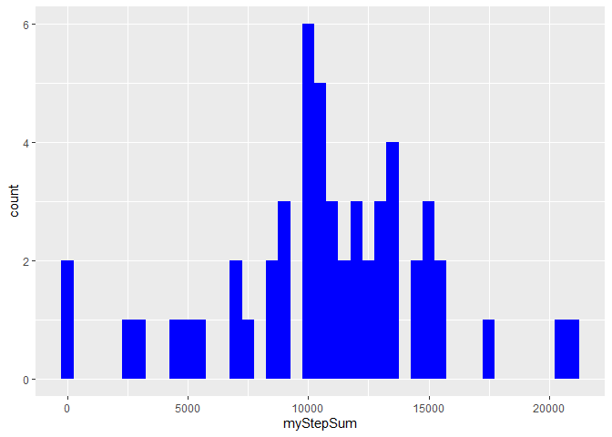
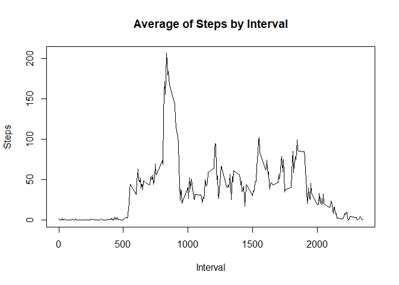
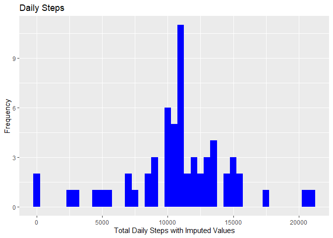
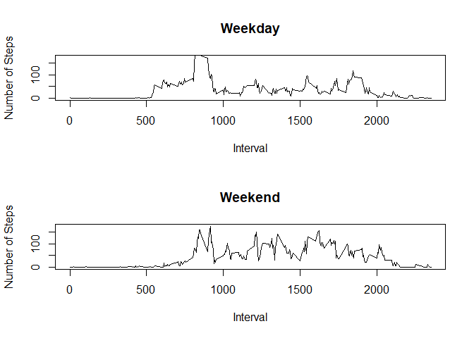

```
{r setup, include=FALSE}
knitr::opts_chunk$set(echo = TRUE)
```


Load libraries and dataset

```r
library("dplyr")
```

```
## Warning: package 'dplyr' was built under R version 4.0.3
```

```
## 
## Attaching package: 'dplyr'
```

```
## The following objects are masked from 'package:stats':
## 
##     filter, lag
```

```
## The following objects are masked from 'package:base':
## 
##     intersect, setdiff, setequal, union
```

```r
library("lubridate")
```

```
## 
## Attaching package: 'lubridate'
```

```
## The following objects are masked from 'package:base':
## 
##     date, intersect, setdiff, union
```

```r
library("ggplot2")
```

Read in the Fitbit dataset

```r
myFitbit <- read.csv("FitbitActivity.csv")
```

Transform date field into useable format

```r
myNewSteps <- myFitbit
myNewSteps$date <- as.Date(myNewSteps$date,format="%m/%d/%Y")
```

Calculate the number of steps taken each day

```r
mySummarySteps<-myNewSteps %>% group_by(date) %>% dplyr::summarise(myStepSum=sum(steps))
```

```
## `summarise()` ungrouping output (override with `.groups` argument)
```


Create histogram of the total number of steps per day using original data

```r
ggplot(mySummarySteps,aes(x=myStepSum)) + geom_histogram(binwidth = 500, fill="blue")
```

```
## Warning: Removed 8 rows containing non-finite values (stat_bin).
```

<!-- -->

Find the mean and median of the total number of daily steps

```r
myMean <- mean(mySummarySteps$myStepSum,na.rm = TRUE)

myMedian <- median(mySummarySteps$myStepSum,na.rm = TRUE)


print(myMean)
```

```
## [1] 10766.19
```

```r
print(myMedian)
```

```
## [1] 10765
```
Time series plot of the 5 minute intervals 


```r
myIntervalData <- aggregate(steps ~ interval,data=myNewSteps,FUN=mean)
plot(myIntervalData,type="l",xlab="Interval",ylab="Steps",main="Average of Steps by Interval")
```

<!-- -->

Calculate which 5 minute interval across all datasets contains the maximum number of steps

```r
maxInterval<-myIntervalData[myIntervalData$steps>=max(myIntervalData$steps),]$interval

print(maxInterval)
```

```
## [1] 835
```

Calculate and report the total number of missing values in dataset

```r
myNA<-is.na(myFitbit$steps)
myCountNA<-sum(myNA)

print(myCountNA)
```

```
## [1] 2304
```

Impute the missing values in the dataset

```r
myImputeSteps <- myNewSteps %>% group_by(interval) %>% 
   mutate(newsteps=ifelse(is.na(steps),mean(steps,na.rm=TRUE),steps))
myWkDaySteps <- myImputeSteps %>% mutate(WkDaySteps=ifelse(weekdays(date)
   %in% c("Saturday","Sunday"), "Weekend","Weekday"))
myWkDaySteps2<-myWkDaySteps %>% mutate(WkDaySteps=as.factor(WkDaySteps))

myWkIntSteps <- myWkDaySteps %>% group_by(interval,WkDaySteps) %>% 
   summarize(mean=mean(steps,na.rm=TRUE))
```

```
## `summarise()` regrouping output by 'interval' (override with `.groups` argument)
```

```r
##RESULT: Imputing missing values did not affect the mean and median when compared to the original data set.
```

Create histogram of the total number of steps taken each day;Plot Imputed valus in myImputeStepsDaily

```r
myImputeStepsDaily <- myImputeSteps %>% group_by(date) %>% summarize(total=sum(newsteps))
```

```
## `summarise()` ungrouping output (override with `.groups` argument)
```

```r
ggplot(myImputeStepsDaily,aes(total))+geom_histogram(binwidth=500,fill="blue")+labs(x="Total Daily Steps with Imputed Values",y="Frequency",title="Daily Steps")
```

<!-- -->
Calculate and report the mean and median of the total number of steps per day.

```r
newMean<-mean(myImputeStepsDaily$total)
newMedian<-median(myImputeStepsDaily$total)

print(newMean)
```

```
## [1] 10766.19
```

```r
print(newMedian)
```

```
## [1] 10766.19
```

Create a factor variable in dataset indicating "weekday" or "weekend"

```r
 myWkDays <- myWkDaySteps[myWkDaySteps$WkDaySteps=="Weekday",]

myWkEnds <- myWkDaySteps[myWkDaySteps$WkDaySteps=="Weekend",]

myDailyWkdayInt <- aggregate(steps~interval,data=myWkDays,FUN=mean)
myDailyWkendInt <- aggregate(steps~interval,data=myWkEnds,FUN=mean)
```
Make a panel plot of time series of the 5-minute interval and average number 
of steps taken.

```r
par(mfrow=c(2,1))

plot(myDailyWkdayInt$interval,myDailyWkdayInt$steps,type="l",xlab="Interval",
ylab="Number of Steps",main="Weekday",ylim=range(myDailyWkendInt$steps))

plot(myDailyWkendInt$interval,myDailyWkendInt$steps,type="l",xlab="Interval",
ylab= "Number of Steps",main="Weekend",ylim=range(myDailyWkendInt$steps))
```

<!-- -->


